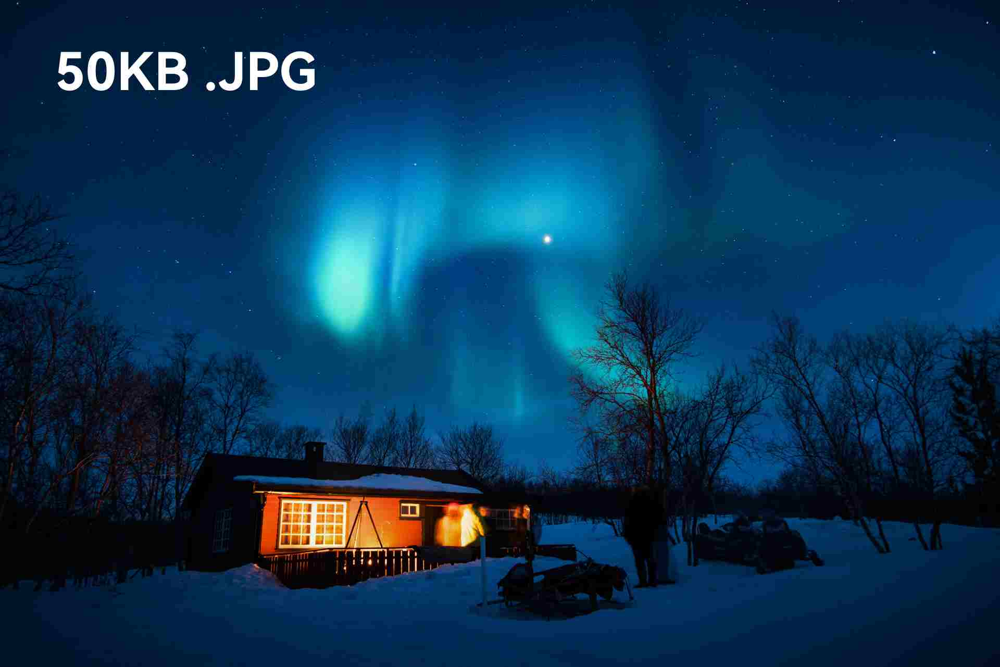
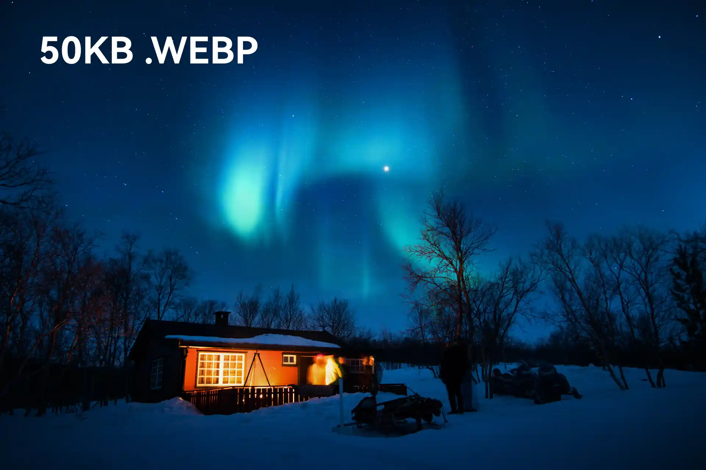

# Test

## 图片格式质量对比
### 50KB JPG

### 50KB [WEBP](https://caniuse.com/webp)

### 50KB [AVIF](https://caniuse.com/avif)

## 视频
### [HEVC](https://caniuse.com/hevc)
视频格式: HEVC 1920*1080 60FPS 4093KB/S

音频格式: AAC 194KB/S

链接: OneDrive 网盘直链 国内速度应该很随缘
<video src="https://storage.live.com/items/3A465F2B4572F106%21124" preload="none" controls></video>

### 奶牛快传 站外
视频格式和上方一致

[r6e.mp4](https://cowtransfer.com/s/67d16633464640)

### BiliBili 嵌入
<iframe src="//player.bilibili.com/player.html?aid=225789230&bvid=BV1xb411f7vH&cid=1049205044&page=1" scrolling="no" border="0" frameborder="no" framespacing="0" allowfullscreen="true" width="100%" height="430px"> </iframe>

### YouTube 嵌入
<iframe width="100%" height="413" src="https://www.youtube.com/embed/OlsJcZyirx8" title="YouTube video player" frameborder="0" allow="accelerometer; autoplay; clipboard-write; encrypted-media; gyroscope; picture-in-picture; web-share" allowfullscreen></iframe>