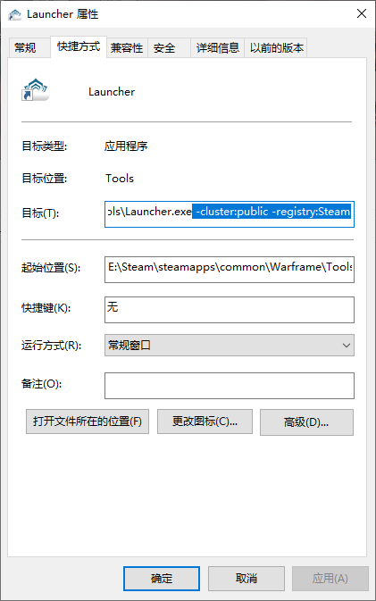

# Warframe 启动和结束

## 1. 跳过 Steam 启动
`Warframe/Tools/Launcher.exe` 创建一个Launcher文件的快捷方式

快捷方式目标属性添加下面参数 **( ! 注意空格 )**

```
 -cluster:public -registry:Steam
```



启动快捷方式即可

::: warning 注意
无法使用Steam相关功能 如: Steam时长统计,创意工坊商店
:::

## 2. 快速结束游戏
创建个`.bat` 或者 `.cmd` 文件,内容如下

```
taskkill /f /t /im Launcher.exe
taskkill /f /t /im warframe.exe
taskkill /f /t /im Warframe.x64.exe
```

运行即可结束游戏
::: tip 建议
使用 [UTools](https://u.tools/) 搜索启动, 提高效率
:::