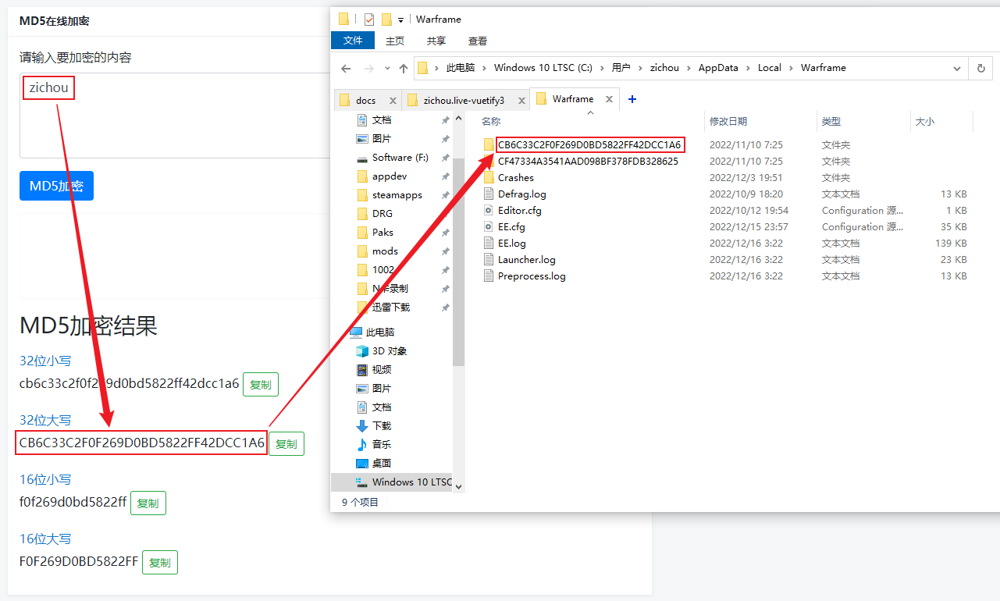

# Warframe 设置备份

## 1. 设置备份
目录 `C:\Users\{你的用户名}\AppData(隐藏)\Local\Warframe`

整个文件夹备份即可

## 2. 更改ID后设置初始化?
### 原因
Warframe 会根据游戏ID来决定设置文件的存放路径, 更改ID后存放路径发生变化, 就不会读取旧ID路径的设置文件, 而是初始化一个新的设置文件.
### 存放路径
文件夹的名字是由游戏ID经过MD5加密生成

例如: 游戏ID `zichou` 经过MD5加密后会生成名为 `CB6C33C2F0F269D0BD5822FF42DCC1A6` 的文件夹来存放此游戏ID的设置文件

### 解决方法

