# Windows 系统设置

## 0 装前细节
1. 提前准备好驱动的新版安装包, 特别是显卡和网卡
   - 显卡: 文件体积大
   - 网卡: 避免无法上网的个别情况
2. 系统初始化时不要连网, 直到显卡驱动安装完毕
   - 避免 Windows 自动下载体积大且版本老旧的显卡驱动
   - 加快初始化速度, 避免因网络造成的影响

## 1 设置

### 关闭鼠标精准
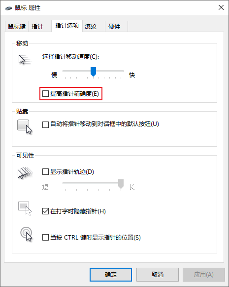

### 关闭 UAC 提示
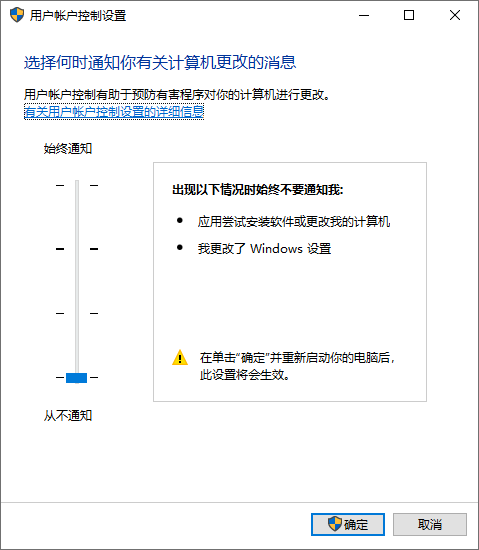

### 关闭防火墙
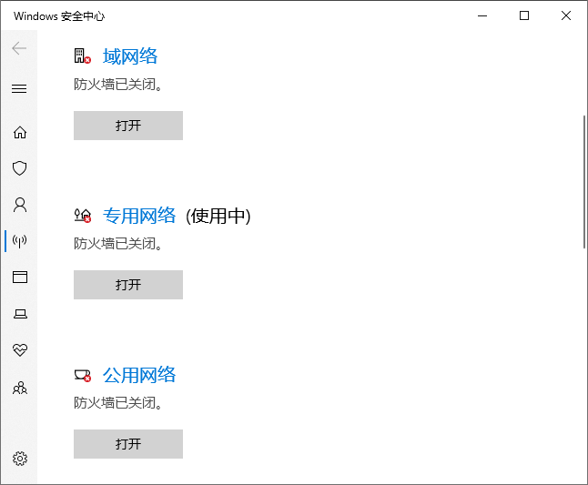

### 关闭驱动器优化计划
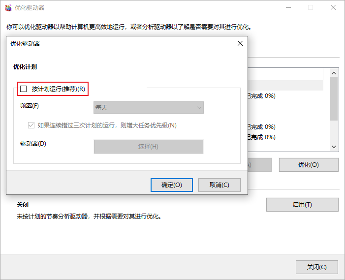

### 关闭粘滞快捷键
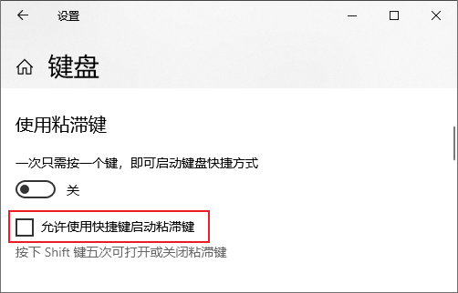

### 关闭传递优化
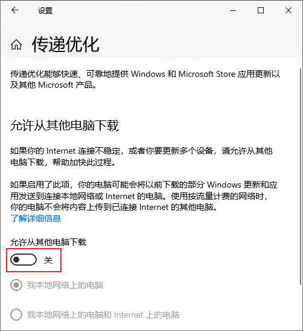

### 关闭窗口最小化鼠标手势
:::tip 提示
新版系统默认关闭, 旧版在组策略关闭
:::
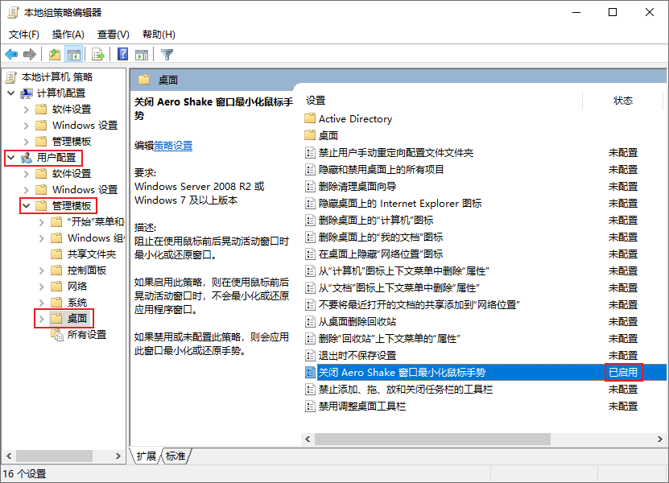

### 关闭 Store 自动更新
:::tip 提示
LTSC版本添加Store的方法: [Github](https://github.com/kkkgo/LTSC-Add-MicrosoftStore)
:::
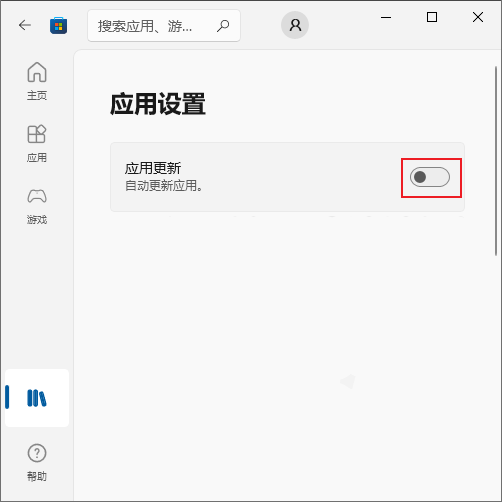

### 资源管理器 (Explorer)
- 开启 `文件扩展名` `隐藏的项目`
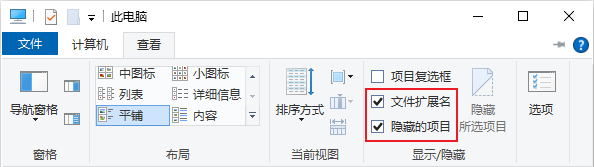
- 文件夹选项
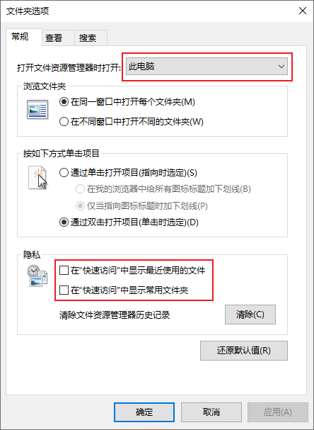

### 性能选项
关闭一些过度动画, 效率至上
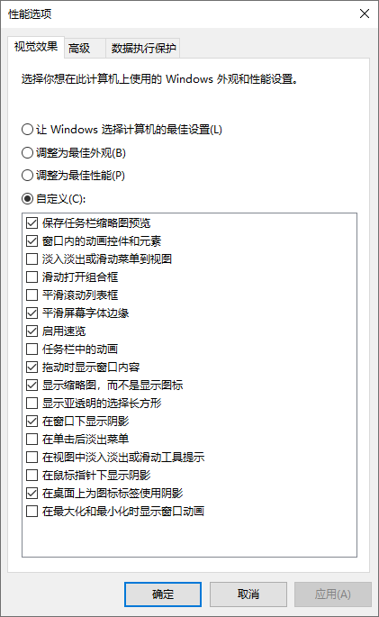

### 虚拟内存
根据自己的使用量, 设置一个尽量大的虚拟内存 (占用<80%). 个人建议 50G+

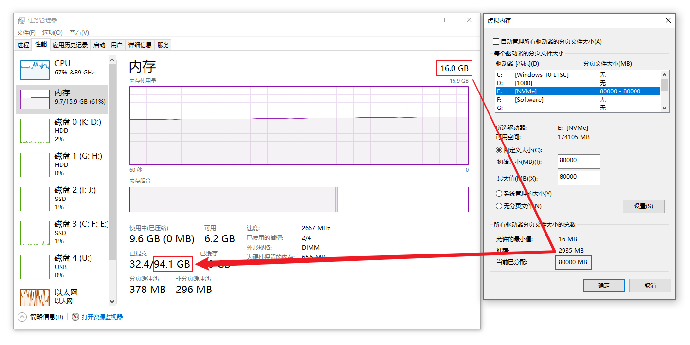

## 2 电源选项

### 高性能
- 设置 `卓越性能` / `高性能`

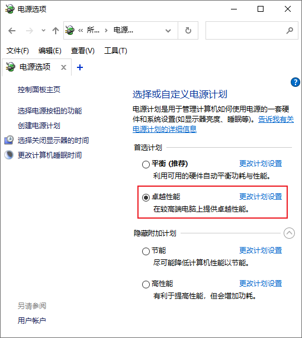

### 关闭 快速启动
- 关闭 `快速启动`, 设置 `不采取任何操作` 避免误关机

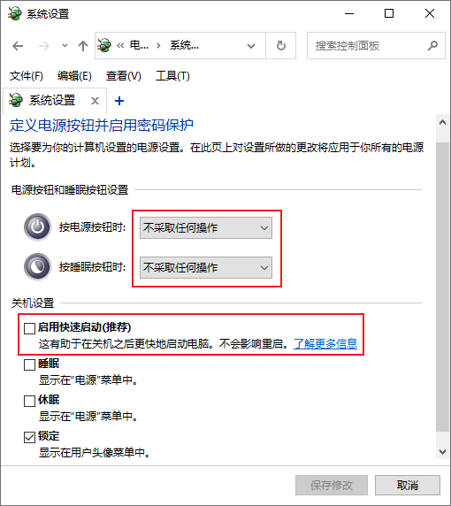

### 全大核调度 
全大核CPU的可能会更佳?
``` bash
powercfg -attributes SUB_PROCESSOR bae08b81-2d5e-4688-ad6a-13243356654b -ATTRIB_HIDE
```
``` bash
powercfg -attributes SUB_PROCESSOR 93b8b6dc-0698-4d1c-9ee4-0644e900c85d -ATTRIB_HIDE
```
::: tip 默认值
- 异类线程调度策略 `自动`
- 异类短运行线程调度策略 `首选高性能处理器`
:::
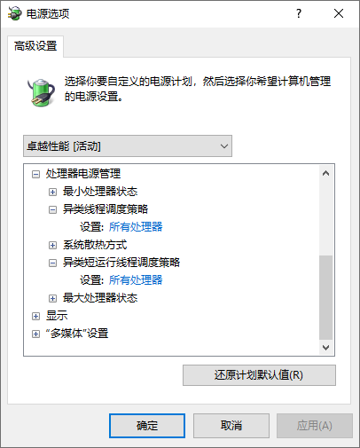

## 3 睡眠相关
::: tip 
 1. 睡眠
    
    数据保存在内存里, 内存条保持供电
    - 优点: 开机快
    - 缺点: 断电后数据丢失

 2. 休眠
 
    数据保存在硬盘里, 和关机一样的断电
    - 优点: 不需要保持供电
    - 缺点: 影响硬盘寿命
    
 3. 混合睡眠
 
    睡眠+休眠, 主睡眠次休眠, 断电后从硬盘读取数据

 4. 睡眠和关机的功耗

    我的实测数据:
     - 睡眠: 7W (不建议断电)
     - 关机: 5W (可断电)
:::
 - `电源选项` 关闭混合睡眠

    

 - `设备管理器` 关闭键盘,鼠标和网卡的唤醒

    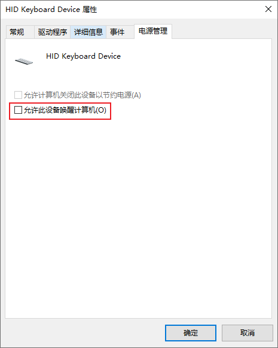

    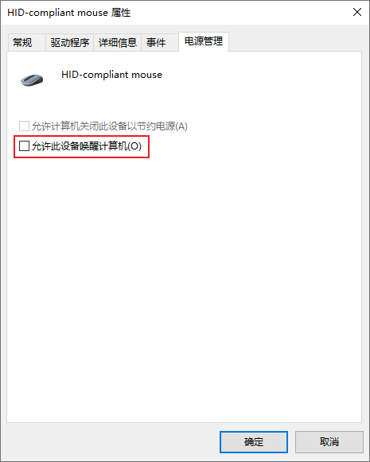

    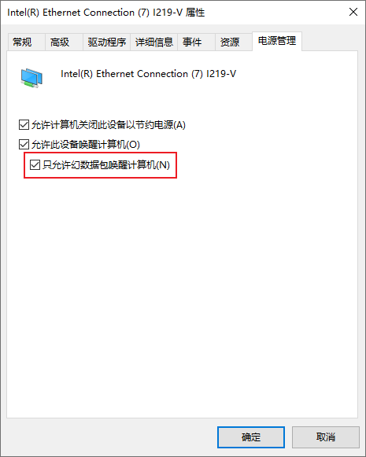

## 4 关闭 基于虚拟化的安全性
``` bash
bcdedit /set hypervisorlaunchtype off
```

## 5 危险性操作

### 关闭 Defender
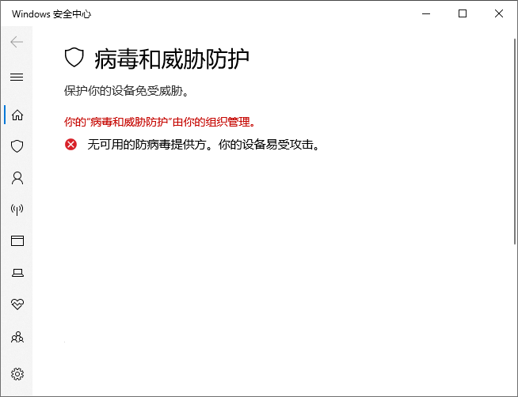

<!-- ### 关闭 MsMpEng.exe
- 名称
  - [Antimalware Service Executable](https://cn.bing.com/search?q=Antimalware+Service+Executable)
- 目录
  - Windows 10: `C:\Program Files\Windows Defender`
  - Windows 11: `C:\ProgramData(隐藏)\Microsoft\Windows Defender\Platform`

在不启动系统的情况下 (使用另一个系统), 修改目录名字让其找不到文件 -->

<!-- ### 脚本
[蓝奏云](https://wwe.lanzoui.com/iJtQe1c4prqb)
(关闭 Defender,自动更新,遥测,SysMain,WSearch) -->